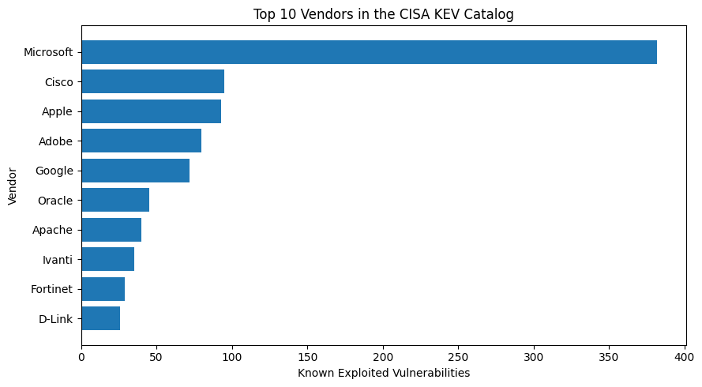
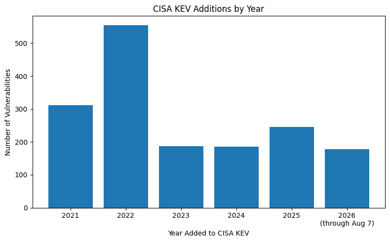

# CISA KEV SQL Investigation

A short cybersecurity data investigation using the U.S. Cybersecurity and Infrastructure Security Agency (CISA) Known Exploited Vulnerabilities (KEV) catalog.

## Objective

Explore patterns in vulnerabilities known to have been exploited in the wild, with a focus on vendors, products, ransomware-associated vulnerabilities, and changes over time.

## Dataset

CISA Known Exploited Vulnerabilities (KEV) Catalog.

- 1,662 vulnerability records
- 11 fields
- No missing values
- No duplicate CVE IDs
- No malformed CVE IDs
- No invalid dates detected during data-quality inspection

## Tools

- SQL
- DuckDB
- Python
- pandas
- Google Colab
- Matplotlib
- Asta DataVoyager for data-quality inspection

## Investigation Questions

1. Which vendors have the most vulnerabilities in the KEV catalog?
2. Which products appear most frequently?
3. What proportion of KEVs are associated with known ransomware campaigns?
4. Which vendors have the most ransomware-associated vulnerabilities?
5. How many vulnerabilities were added to the KEV catalog each year?

## Key Findings

- Microsoft had the highest number of KEVs: **382**
- Windows was the most frequently represented specific product: **170**
- **338 vulnerabilities (20.3%)** were marked as associated with known ransomware campaign use
- Microsoft had **104 ransomware-associated KEVs**, the highest absolute count among vendors
- **2022** had the highest number of additions to the catalog: **555**
- 2026 data is partial and covers records available through **August 7, 2026**

## Important Interpretation Notes

`dateAdded` represents when CISA added a vulnerability to the KEV catalog, not necessarily when exploitation first occurred.

`Unknown` ransomware campaign use does not mean that ransomware use did not occur. It means that known ransomware campaign use is not identified in the catalog.

## Visualizations

## Files

- `cisa_kev_sql_investigation.ipynb` — full analysis notebook
- `analysis.sql` — SQL queries used in the investigation
- `top_vendors.png` — vendor visualization
- `kev_by_year.png` — annual KEV additions visualization
